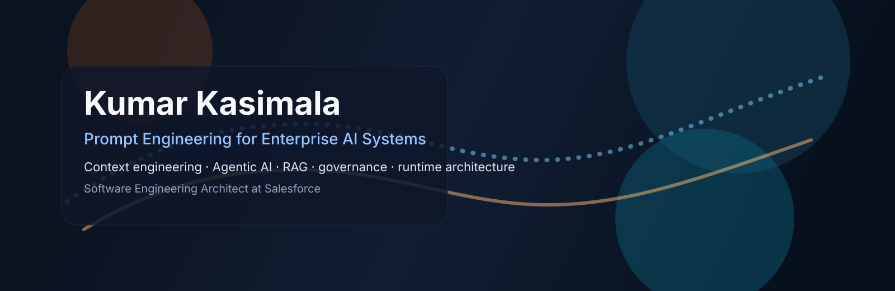

  

# Kumar Kasimala

Software Engineering Architect focused on `Prompt Engineering for Enterprise AI Systems`.

I build enterprise AI platforms where prompts, context, tools, model routing, governance, and observability are treated as production runtime infrastructure. My specialization is not prompt writing alone. It is the design of reusable prompt systems, governed lifecycle management, grounded context assembly, retrieval, agent orchestration, and secure execution at enterprise scale.

## What I Work On

- Prompt lifecycle management, versioning, evaluation, and deployment
- Context engineering for grounded AI, runtime data resolution, and RAG
- Agentic AI orchestration with tools, actions, workflow state, and handoffs
- Multi-model and multi-LLM routing across enterprise AI execution layers
- Trust, observability, policy-aware execution, and prompt injection defense
- Cloud-native, event-driven, multi-tenant AI platform architecture

## Original Contribution Themes

| Theme | What it means in practice |
| --- | --- |
| Enterprise prompt runtime architecture | Prompt templates, lifecycle hooks, context builders, policy constraints, model routing, telemetry |
| Context engineering | Resolving and assembling enterprise context so outputs are accurate, explainable, and compliant |
| Agentic AI orchestration | Deterministic workflow paths that coordinate LLMs, tools, memory, and review steps |
| Scalable enterprise AI platforms | Multi-tenant architecture, APIs, distributed workflows, and reusable platform frameworks |

## Public Work

- [Google Scholar](https://scholar.google.com/citations?user=K5Q8wwoAAAAJ)
- [Patents: US11199944B2](https://patents.google.com/patent/US11199944B2/en)
- [SF Bay ACM talk: From Prompt Grounding to Edge Delivery](https://www.sfbayacm.org/event/from-prompt-grounding-to-edge-delivery-agentic-ai-at-scale/)
- [WCSC 2026 keynote](https://www.scrs.in/conference/wcsc2026/speaker/talk/2069)
- [TDX 2026: Lock in Prompt Response Formats with Structured Outputs](https://reg.salesforce.com/flow/plus/tdx26/sessioncatalog/page/catalog/session/1771032017004001Utp2)
- [Public evidence map: talks, publications, patent, Salesforce links, and coverage](./REFERENCES.md)

## Selected Repositories

| Repository | Purpose |
| --- | --- |
| [prompt-control-plane](https://github.com/kumarkasimala/prompt-control-plane) | Reference architecture for enterprise prompt runtime infrastructure |
| [salesforce-agentforce-prompt-templates](https://github.com/kumarkasimala/salesforce-agentforce-prompt-templates) | Public Salesforce/Agentforce-style prompt template examples |
| [langgraph](https://github.com/kumarkasimala/langgraph) | Agent orchestration, runtime control, governance, and workflow patterns |
| [promptfoo](https://github.com/kumarkasimala/promptfoo) | PromptOps, evaluation, and red-team regression patterns |
| [semantic-conventions](https://github.com/kumarkasimala/semantic-conventions) | GenAI observability and telemetry conventions |
| [agent-framework](https://github.com/kumarkasimala/agent-framework) | Multi-agent workflow orchestration patterns |
| [llama_index](https://github.com/kumarkasimala/llama_index) | Context engineering, RAG, and grounding patterns |
| [haystack](https://github.com/kumarkasimala/haystack) | Production RAG pipelines and context-driven AI workflows |

## Profile Signals

- Salesforce Software Engineering Architect
- Prompt Engineering for Enterprise AI Systems
- Context engineering and grounded AI
- Agentic AI orchestration and enterprise workflow runtime design
- Public speaking, patents, scholarly writing, and peer review activity

## Reference Links

- [Salesforce Prompt Builder](https://www.salesforce.com/artificial-intelligence/prompt-builder/)
- [Agentforce announcement](https://www.salesforce.com/news/press-releases/2024/09/12/agentforce-announcement/)
- [Salesforce Engineering: modular, multi-model framework for enterprise AI agents](https://engineering.salesforce.com/engineering-agentforce-building-a-modular-multi-model-framework-for-enterprise-ai-agents/)
- [Salesforce Engineering: grounding enterprise AI with live retrieval and citations](https://engineering.salesforce.com/grounding-enterprise-ai-with-live-web-retrieval-and-verifiable-citations/)

## What This Profile Is For

This profile is meant to make the first impression clear: enterprise prompt systems, grounded AI, agentic workflows, and platform architecture. It is intentionally aligned with original contributions, selective open-source participation, and public technical visibility.
